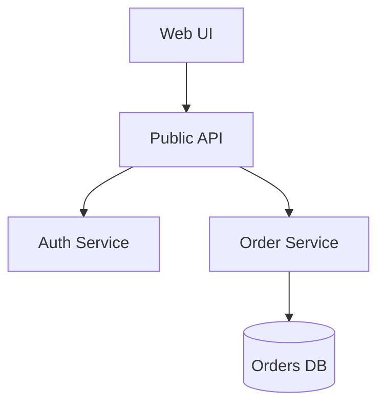
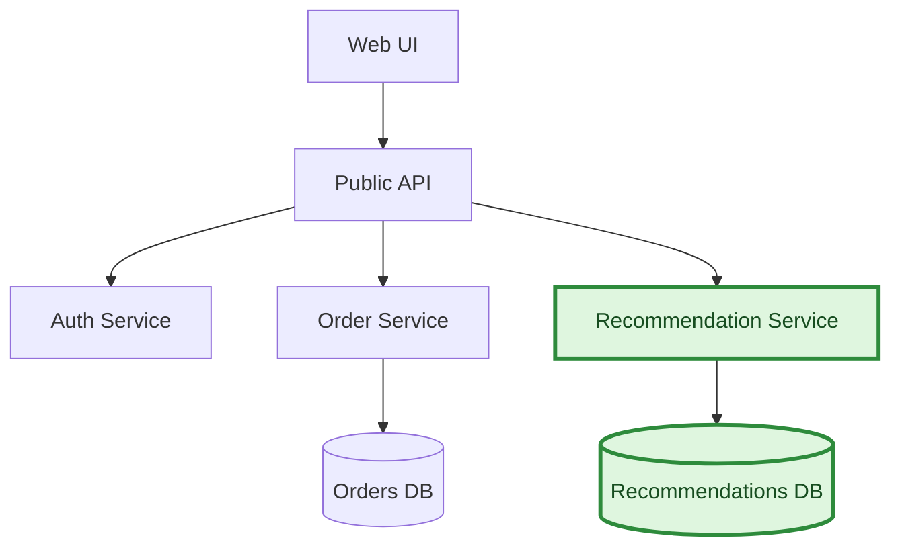
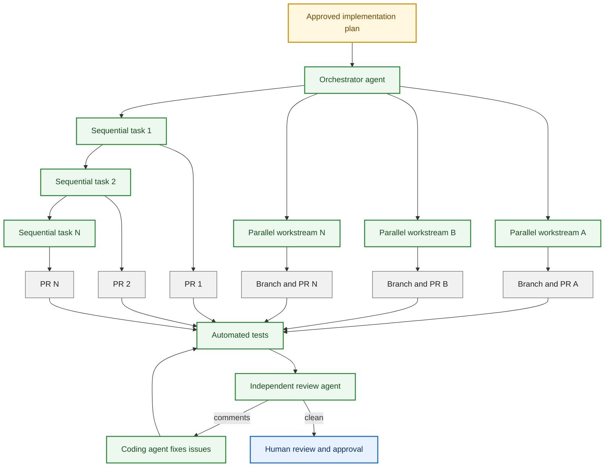
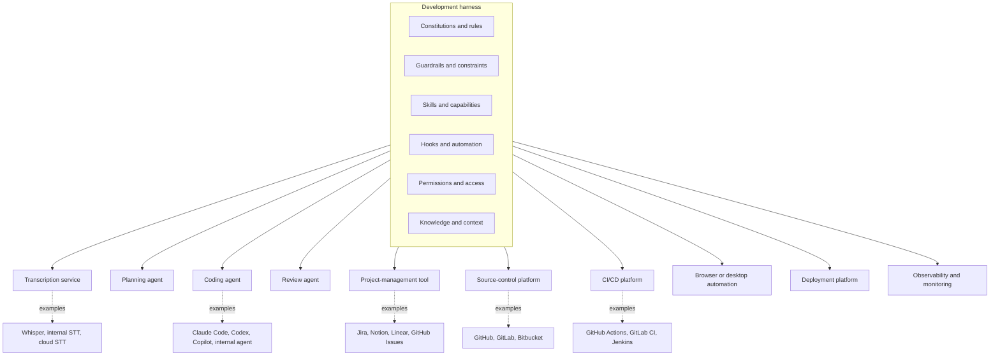
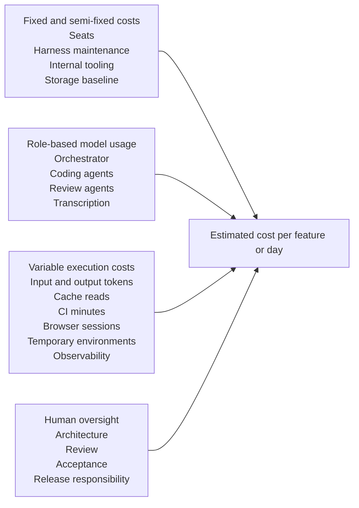

AI-assisted development is usually discussed at the level of individual coding tools. We compare Claude Code, Codex, Copilot, Devin, and other agents. We ask which model writes better code, which one understands a repository better, or which one can finish a task with fewer prompts.

I think this perspective is too narrow.

The more important question is not which coding agent we should use. The question is how the entire software development lifecycle should work when AI agents can participate in almost every stage.

I want to describe two related things:

- a **lifecycle model** that defines the stages through which software changes move;
- an **operating model** that defines what humans and AI agents are responsible for at every stage.

The final goal is a **software factory**: a concrete, working implementation of this model inside a real software company.

This is not yet a detailed framework. A framework would need precise rules, required artifacts, interfaces, policies, failure-handling procedures, and implementation guidance. That may become a separate article. For now, I want to describe the overall process and the division of responsibility between humans and AI.

## The tools are replaceable

This model is not tied to one AI provider or one development product.

I currently focus on Claude and Codex because these are the tools I use most often. Another company may use Copilot, Devin, local models, internal agents, or something that does not exist yet.

The same applies to development methodologies and specification tools. A company may use Spec Kit, BMAD, its own templates, or no formal specification framework at all. These methods can be used inside the lifecycle, but they represent only one part of it.

We might still use familiar project-management tools such as Jira, Notion, Linear, or GitHub Issues. However, in this model, humans do not necessarily interact with them directly.

Instead, AI agents can operate these systems on our behalf.

For example, after a customer conversation is recorded and transcribed, an agent can analyze the transcript and automatically create a ticket describing the issue or feature. It can assign labels, determine priority, link related work, and place the ticket into the appropriate workflow.

From there, agents can continue managing the lifecycle of that ticket: triaging it, moving it between states, starting work, updating progress, and eventually marking it as done or ready for testing.

These tools are components inside the process. They are not the process itself.

The lifecycle should remain stable even when the agents, models, orchestration tools, source-control platforms, or project-management systems are replaced.

## The complete lifecycle

The following diagram shows the process at a high level. Blue nodes are explicit human checkpoints. Green nodes are AI-owned execution stages. Architecture mapping is prepared by AI but requires human approval before implementation proceeds.

```mermaid
flowchart LR
    accTitle: Human-governed AI software development lifecycle
    accDescr: Twelve stages move left to right from customer conversation to production, with human review and feedback loops.
    C[1. Customer conversation]:::human --> T[2. Transcribe and structure]:::ai
    T --> H1[3. Human review and prioritization]:::human
    H1 --> A[4. Architecture mapping]:::shared
    A --> P[5. Plan and task decomposition]:::ai
    P --> I[6. Agent implementation]:::ai
    I --> X[7. Automated testing]:::ai
    X --> R[8. Agentic review loop]:::ai
    R --> H2[9. Human review and acceptance]:::human
    H2 --> D[10. Merge and deploy to staging]:::ai
    D --> H3[11. Human staging validation]:::human
    H3 --> PROD[12. Release to production]:::ai

    R -. review comments .-> I
    H2 -. rejected or changes requested .-> P
    H3 -. issues found .-> P
    PROD -. monitoring, bugs, new requests .-> C

    classDef human fill:#e8f1ff,stroke:#1769d2,stroke-width:2px,color:#0b326d;
    classDef ai fill:#edf9ee,stroke:#2e8b3c,stroke-width:2px,color:#174d20;
    classDef shared fill:#fff7df,stroke:#d48b00,stroke-width:2px,color:#6f4700;
```

The goal is not to remove humans from the lifecycle. The goal is to place human attention at the points where judgment, accountability, context, and risk acceptance matter most.

## The process starts with a conversation

Software development usually starts with communication.

In a greenfield project, the customer explains what they want to build. In a brownfield project, the customer describes a change, a problem, or a new feature that should be added to an existing system.

This conversation should be recorded.

The recording is then transcribed using speech-to-text models. The transcription can happen locally on an engineer’s machine or inside the company’s internal infrastructure.

Modern speech-to-text models can run efficiently on consumer GPUs. This makes transcription relatively cheap and allows the company to keep confidential conversations inside its own network.

The raw transcription is not yet a requirement specification. It may contain repetitions, contradictions, uncertain ideas, side discussions, and requests that should not be implemented.

An AI agent processes the transcript and produces a structured result:

- a cleaned transcript;
- a summary of the conversation;
- unresolved questions;
- candidate requirements;
- possible action items;
- risks and assumptions;
- a proposed list of implementation tasks.

At this point, AI organizes the information, but it does not decide what the company will build.

That decision belongs to humans.

## Humans own intent and priorities

A human reviews the proposed requirements and action items.

The human decides:

- what should be implemented;
- what should be rejected;
- what should be postponed;
- what requires clarification;
- what is technically or commercially unreasonable;
- what has the highest priority.

This responsibility cannot simply be delegated to an AI agent.

The transcript contains what people said. It does not necessarily contain what the organization should do.

Humans remain responsible for understanding business intent, resolving contradictions, negotiating scope, and choosing the direction of the product.

Once the scope is approved, AI can continue processing it.

## Requirements must be mapped to architecture

The next step is to connect the approved requirements to the architecture of the system.

For a greenfield project, this may include creating the first version of the architectural documentation:

- system modules;
- service boundaries;
- database schemas;
- server interactions;
- external integrations;
- interfaces;
- classes;
- dependency diagrams;
- deployment topology.

For a brownfield project, these architectural artifacts should already exist.

Instead of rediscovering the architecture from the codebase for every new task, the team identifies which parts of the existing architecture must change.

For example, suppose the current system looks like this:

A new recommendation feature could be proposed as a highlighted change to the same baseline:

The important idea is that architecture should not remain passive documentation that becomes outdated after implementation.

Architecture should become an **active control artifact**.

Before agents change the code, they should understand which architectural elements are expected to change. After implementation, the architecture documentation should reflect what was actually built.

AI agents can prepare these architectural proposals, but humans should review and approve the architectural direction.

## One conversation can become one development branch

This process can be automated further.

Imagine an internal service that receives a meeting recording and processes it securely inside the organization.

The service could:

1. transcribe the recording;
2. clean and organize the transcript;
3. extract candidate requirements;
4. create a development branch;
5. store the transcript and related documents in that branch;
6. create or update an issue in the project-management system;
7. notify the responsible engineer.

An engineer could then check out the branch and immediately have access to the original conversation, the cleaned transcript, the extracted requirements, and the initial analysis.

The engineer could start a local coding agent and instruct it to read these materials, inspect the repository, and prepare the architectural proposal.

The customer conversation would no longer disappear into meeting notes, private messages, or somebody’s memory. It would become part of the traceable development history.

## From architecture to an implementation plan

After the human approves the task and its architectural direction, an AI agent can create the implementation plan.

At this point, the agent has:

- the original transcript;
- the approved requirements;
- the architectural proposal;
- the existing architecture documentation;
- access to the codebase;
- access to the project’s development rules.

The agent explores the repository and identifies the concrete changes required to implement the approved design.

The plan should not assume that one agent will perform all the work sequentially.

From the beginning, it should consider how the task can be divided between multiple agents.

Some changes may need to happen sequentially. One pull request may introduce a foundation required by the next pull request. This can produce a stack of dependent pull requests.

Other changes may be independent. Several agents can work on them in parallel and create separate branches and pull requests.

The plan should therefore describe not only what must be changed, but also:

- which tasks can run in parallel;
- which tasks depend on other tasks;
- which pull requests should be created;
- how they should be ordered;
- how conflicts will be avoided;
- what each agent is allowed to modify;
- how the complete feature will be integrated.

Importantly, this plan can be treated as a first-class artifact. When an engineer runs an agent in planning mode, the resulting plan can be saved into the repository, committed to the development branch, and reviewed like any other change.

Implementation does not have to start immediately. The team can create the plan today, commit it, and return to the same branch later—days or weeks later—to continue execution from that saved plan.

## Planning, orchestration, and pull-request strategy

The orchestration layer is also an abstraction. A company may use one strong model as a central orchestrator, allow engineers to launch agents manually, or use a custom internal service.

The exact orchestration mechanism is replaceable. The important part is that the agents follow the approved plan and the rules provided by the organization.

## The development harness

Agents should not work in an unrestricted environment.

Every engineering organization should provide a development harness that defines how agents are expected to operate.

The harness is the combination of instructions, tools, skills, hooks, policies, templates, checks, and guardrails available to every agent.

It may include project-specific rules such as:

- methods should not exceed ten lines;
- classes should not exceed one hundred lines;
- one class should be stored in one file;
- new functionality must include tests;
- architectural boundaries must not be crossed;
- specific directories must not depend on each other;
- generated code must pass security checks;
- database migrations must be backward-compatible;
- agents must not modify unrelated files;
- agents must not merge without human approval.

Some of these rules can be expressed as agent instructions or project constitutions. Others can be enforced through linters, tests, hooks, CI checks, repository permissions, or architectural validation tools.

The harness may also give agents access to reusable skills:

- creating specifications;
- exploring repositories;
- writing tests;
- operating browsers;
- updating project-management systems;
- creating pull requests;
- reviewing code;
- deploying to staging;
- updating architecture diagrams.

The harness ensures that different agents operate according to the same organizational standards.

Without it, every agent session becomes an isolated experiment.

## Agents execute the plan

After the plan is approved, agents execute it according to the organization’s orchestration policy.

There are many possible configurations.

An expensive and capable model may work as an orchestrator. It can divide the plan into smaller tasks, spawn specialized sub-agents, monitor their results, and coordinate integration.

Another organization may use a simpler workflow in which engineers start agents manually.

Some agents may run locally on developer machines. Others may run on internal servers or in cloud environments.

Agents should be able to perform the full implementation workflow:

- change the code;
- create tests;
- update documentation;
- update architecture artifacts;
- create atomic commits;
- push branches;
- open pull requests;
- connect pull requests to tasks;
- update statuses in the project-management system;
- prepare everything for review.

When the agents finish, the human should receive a reviewable result, not a collection of unfinished files.

## Agents must test real behavior

Testing should not be limited to writing unit tests and checking whether they pass.

Agents should run the application and interact with it.

For a web application, an agent should be able to:

- start the required services;
- apply database migrations;
- open the application in a real browser;
- authenticate when necessary;
- perform the user flow;
- inspect the resulting state;
- capture logs, screenshots, or recordings;
- verify that the behavior matches the requirements.

For a desktop application, an agent should launch it and interact with the interface through desktop-control tools.

For an API, the agent should start the service, send realistic requests, verify responses, and inspect side effects.

For infrastructure changes, the agent should validate the resulting environment in a safe testing context.

The goal is not only to prove that the code compiles. The agent should demonstrate that the implemented behavior works.

## Agentic review before human review

A pull request created by one agent should not immediately be handed to a human.

First, it should pass through one or more independent AI review agents.

A review agent examines the pull request and leaves comments. The coding agent reads those comments, fixes the identified issues, and pushes another commit.

The new push triggers another review.

This cycle continues:

**implementation → review → correction → review**

It should stop only when the review agent has no further actionable comments or when the process reaches a defined escalation condition.

The review should cover more than style.

Review agents can check:

- correctness;
- security;
- architecture;
- maintainability;
- test coverage;
- performance;
- backward compatibility;
- unintended changes;
- compliance with the approved specification;
- compliance with the project harness.

Different review agents may specialize in different areas.

This process can run locally, on internal servers, through a source-control platform, or through a CI system.

The implementation agent and review agent should not be the same agent operating with the same context and assumptions. Independent review is valuable because it introduces a different perspective before a human spends time on the change.

## Humans review intent, not every keystroke

After the agentic implementation, testing, and review cycles are complete, a human returns to the process.

The human reviews whether the implementation matches the original intent.

The main questions are not only:

- Is this code syntactically correct?
- Are all the tests passing?
- Is every method formatted properly?

The more important questions are:

- Did we build what the customer actually needed?
- Does the solution fit the architecture?
- Did the agents make an incorrect assumption?
- Is the user experience appropriate?
- Did we introduce unnecessary complexity?
- Are the risks acceptable?
- Should this change be released?

The human also tests the implementation.

Agents may perform extensive automated and interactive testing, but the human remains responsible for acceptance.

This changes the role of the developer.

The developer does not need to manually type every line of code. The developer becomes responsible for intent, architecture, constraints, verification, debugging direction, and final technical judgment.

## Staging, validation, and release

After human approval, agents can merge the required pull requests in the correct order and deploy the result to a testing or staging environment.

An agent can:

- verify that all required approvals exist;
- merge dependent pull requests in order;
- monitor CI pipelines;
- resolve or escalate merge conflicts;
- deploy the integrated version;
- run smoke tests;
- prepare a deployment report.

After deployment to staging, a human validates the feature again.

The developer or another responsible person tests both the expected behavior and the integration with the rest of the system.

If everything is correct, the change can be released to production.

The production release may also be automated, but the authorization to release should remain under human or organizational control.

## The correction cycle

Not every implementation will be correct.

If the human finds a problem, the process returns to the coding agent.

The human explains what is wrong and provides additional context. The agent then:

1. investigates the problem;
2. finds the root cause;
3. compares it with the original requirements;
4. determines whether the architecture proposal must change;
5. prepares a correction plan;
6. implements the fix;
7. tests it;
8. sends it through agentic review again;
9. returns it to the human.

The cycle repeats until the result is accepted.

This is not fundamentally different from traditional software development. The difference is that most operational work inside the loop can be performed by agents, while humans guide the direction and validate the outcome.

## How much could the factory cost?

The cost is formed from several different layers:

1. workspace or enterprise seats;
2. model input, cached-input, and output tokens;
3. parallel coding and review-agent runs;
4. CI runner time;
5. temporary development and staging environments;
6. storage, logs, and observability;
7. transcription;
8. human review and platform-maintenance time.

The last item will usually remain the largest cost. Token cost matters, but the meaningful metric is not cost per token. It is **cost per accepted feature**.

### Current reference prices

The following prices were checked on July 23, 2026:

| Component | Price |
|---|---:|
| Claude Sonnet 5 API, input | $2 per 1M tokens through August 31, 2026 |
| Claude Sonnet 5 API, output | $10 per 1M tokens through August 31, 2026 |
| Claude Sonnet 5 standard price after the introductory period | $3 input / $15 output per 1M tokens |
| Claude Opus 4.8 API | $5 input / $25 output per 1M tokens |
| GPT-5.3-Codex API | $1.75 input / $0.175 cached input / $14 output per 1M tokens |
| ChatGPT Business | $25 per user monthly or $20 per user monthly when billed annually |
| Anthropic Team | $30 per user monthly or $25 per user monthly when billed annually, minimum five users |
| GitHub Actions Linux 2-core runner | $0.006 per minute after included allowances |

For organizations, interactive developer access and automated factory execution should usually be treated separately.

Developers may use Business, Team, or Enterprise seats for interactive work. Automated orchestration, review loops, and CI agents should normally use organization-owned API projects or usage-based enterprise access with separate credentials, auditability, budget limits, and per-project spend controls.

### Example: one medium feature in one active day

Assume that one medium feature requires:

- one architecture and planning pass;
- three implementation workstreams;
- four pull requests;
- automated browser and integration tests;
- two review-and-fix cycles;
- 600 Linux CI minutes;
- approximately 4.6 million fresh input tokens;
- approximately 22 million cached input tokens;
- approximately 950,000 output tokens.

Using GPT-5.3-Codex for the entire workload:

- fresh input: 4.6M × $1.75 = **$8.05**;
- cached input: 22M × $0.175 = **$3.85**;
- output: 0.95M × $14 = **$13.30**;
- model total: **$25.20**;
- 600 Linux CI minutes: **$3.60**.

That gives approximately **$28.80** in direct model and CI charges before staging, storage, monitoring, seats, and human time.

A Claude configuration could use Sonnet 5 for coding and review, with Opus 4.8 reserved for architecture or orchestration. Under a similar usage shape, a realistic direct model cost would often be in the same broad range—roughly **$25–40** for the active feature day at the introductory Sonnet 5 price.

A useful planning range is therefore:

- simple change: **$5–20** in direct AI and execution cost;
- medium multi-agent feature: **$30–60**;
- difficult feature with repeated failed attempts, large context, frontier orchestration, and extensive browser testing: **$100–300 or more**.

These are not fixed prices. Repository size, cache effectiveness, output volume, reasoning effort, failed attempts, parallelism, and review depth can change the result by an order of magnitude.

The factory should be evaluated against the human time and accepted output it produces. Spending $50 on agents is expensive if it creates code that cannot be trusted. It is extremely cheap if it replaces several days of routine execution while preserving human architectural control.

## The human remains accountable

AI agents can be responsible for performing many tasks, but they are not accountable in the organizational sense.

Agents can write code, create plans, run tests, update project-management systems, open pull requests, review changes, and deploy environments.

Humans remain accountable for:

- product intent;
- priorities;
- architectural decisions;
- risk acceptance;
- security policy;
- legal and ethical constraints;
- release authorization;
- final quality;
- communication with customers and stakeholders.

This division is important.

The goal is not to remove humans from software development. The goal is to move human attention away from repetitive execution and toward decisions that require context, judgment, responsibility, and understanding.

## The software factory

The lifecycle model describes how work moves through the organization.

The operating model describes how humans and agents participate in that movement.

The software factory is the real implementation of both.

It is not one application and not one AI agent.

It is the complete working system that connects:

- recorded customer conversations;
- local or internal transcription;
- requirements processing;
- architecture documentation;
- source control;
- development branches;
- coding agents;
- agent orchestration;
- project tracking;
- development harnesses;
- automated testing;
- browser and desktop interaction;
- agentic code review;
- human approval;
- CI/CD;
- staging;
- production release;
- monitoring and feedback.

Different companies will implement this factory differently.

Some will build internal platforms. Some will connect existing tools. Some will use GitHub, Claude, Codex, Jira, and local transcription models. Others will use entirely different components.

The tools are variable.

The lifecycle and responsibility boundaries are the stable part.

The company that successfully builds such a factory will not simply have developers who use AI assistants. It will have a software development organization designed around cooperation between humans and AI agents.

That is the transition I believe we are beginning to see.

## Pricing sources

- [Anthropic: Introducing Claude Sonnet 5](https://www.anthropic.com/news/claude-sonnet-5)
- [Anthropic pricing](https://www.anthropic.com/pricing)
- [OpenAI: GPT-5.3-Codex API model](https://developers.openai.com/api/docs/models/gpt-5.3-codex)
- [OpenAI: ChatGPT Business billing and seats](https://help.openai.com/en/articles/8792536-managing-billing-and-seats-in-chatgpt-business-4)
- [GitHub Actions billing](https://docs.github.com/en/billing/concepts/product-billing/github-actions)
